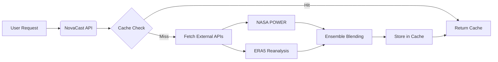

<div align="center">

# NovaCast Weather Forecast

**A modern weather forecasting application built for the NASA Space Apps Challenge 2025.**

NovaCast utilizes advanced ensemble prediction methods combining **NASA POWER** and **ERA5** data to deliver data-driven long range weather trends up to **1.5 years ahead**.

[](https://www.spaceappschallenge.org/)
[](https://novapulse.com.tr)
[](LICENSE)
[](https://fastapi.tiangolo.com/)
[]()

**[View Website](https://novacast.space)** &nbsp;•&nbsp; **[Report Bug](https://github.com/AlpaganB/novacast/issues)**

</div>

---

## Overview

**NovaCast** bridges the gap between historical climate data and future planning. By integrating satellite based observations from NASA POWER with ERA5 reanalysis data, our ensemble engine provides robust long-range weather insights essential for agricultural planning, event scheduling, and resource management.

### Key Features

| Feature | Description |
| :--- | :--- |
| **Long Range Vision** | Extended predictions up to **540 days** (1.5 years) utilizing ensemble forecasting. |
| **Ensemble Engine** | Hybrid blending (50/50) of **NASA POWER** and **ERA5** datasets for enhanced reliability. |
| **Adaptive Caching** | Tiered strategy (1h/3h/6h) optimization to balance data freshness with API efficiency. |
| **PWA Support** | Full Progressive Web App capabilities including offline access and installation. |
| **Planner Mode** | Data driven activity recommendations and location management. |
| **User Experience** | Dark/Light theme switching with an accessible interface. |

---

## Architecture

### Technology Stack

| Component | Technology | Description |
| :--- | :--- | :--- |
| **Backend** |  | Asynchronous API handling for high concurrency requests. |
| **Data Engine** |   | Optimized ensemble calculation and data processing. |
| **Frontend** |  | Lightweight, performance focused implementation. |
| **Styling** |  | Responsive Grid layout with Glassmorphism design system. |

### Data Pipeline



---

## Installation

### Backend Setup

```bash
# Clone the repository
git clone https://github.com/AlpaganB/novacast.git

# Navigate to directory
cd novacast

# Install dependencies
pip install -r requirements.txt

# Run Server
uvicorn main:app --reload
```

### Frontend Configuration

The frontend is built with **Vanilla JavaScript** and requires no build process.

1.  Update the `API_BASE_URL` in `script.js` to point to your backend server.
2.  Serve the `index.html` file using any static file server.

---

## Caching Strategy

To optimize API usage while maintaining data integrity, NovaCast employs a time-graduated caching mechanism:

*   **Near-term (≤3 days):** 1-hour cache. High volatility requires frequent updates.
*   **Mid-range (4-7 days):** 3-hour cache. Balanced update frequency.
*   **Long-range (8+ days):** 6-hour cache. Stable long term trends allow for extended caching.

---

## Browser Compatibility

| Browser | Supported Versions |
| :--- | :--- |
| **Chrome / Edge** | 90+ |
| **Firefox** | 88+ |
| **Safari** | 14+ |
| **Mobile** | Modern WebViews (iOS & Android) |

> **Note:** Internet Explorer is not supported.

---

## License

This project is distributed under the **MIT License**. See `LICENSE` for more information.

## Acknowledgments

*   **NASA POWER Project**: For providing comprehensive solar and meteorological data sets.
*   **Open Meteo**: For historical weather reanalysis data.
*   **NASA Space Apps Challenge**: For fostering innovation and collaboration.

---

<div align="center">
<b>NovaPulse</b> &copy; 2025
</div>
