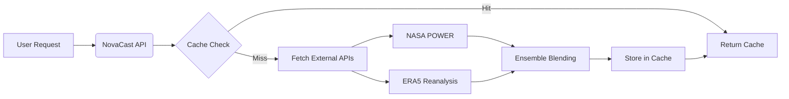

<div align="center">

# NovaCast Weather Forecast

**A modern weather forecasting application built for the NASA Space Apps Challenge 2025.**

NovaCast utilizes advanced statistical ensemble methods combining **NASA POWER** and **ERA5** data to deliver data driven long range weather forecasts up to **1.5 years ahead**.

[](https://www.spaceappschallenge.org/)
[](https://novapulse.com.tr)
[](index.html)
[](index.html)

**[View Website](https://novacast.space)** &nbsp;•&nbsp; **[Report Bug](https://github.com/AlpaganB/novacast/issues)**

</div>

## **Key Features**

| Feature | Description |
| :--- | :--- |
| **GPS Location Support** | Automatically detect your current city with a single click using GPS & Reverse Geocoding. |
| **Smart Forecasting** | Uses weighted ensemble models combining **NASA POWER** historical data and **ERA5** reanalysis. |
| **Long Range Vision** | Extended predictions up to **540 days** (1.5 years) utilizing ensemble forecasting. |
| **Smart Caching** | Tiered backend caching (180/360 days) and multi-city frontend caching for instant load times. |
| **Ensemble Engine** | Hybrid blending of **NASA POWER** and **ERA5** datasets for enhanced reliability. |
| **Global Support** | Seamless coordinate resolution for cities worldwide with localized matching priorities. |
| **In-Memory Caching** | 1 hour TTL cache for instant repeat requests, optimized for low resource servers. |

---

## System Architecture


### Technology Stack

| Component | Technology | Description |
| :--- | :--- | :--- |
| **Backend** |  | Asynchronous API handling for high concurrency. |
| **Data Engine** |   | Vectorized data processing and statistical blending. |
| **Frontend** |  | High performance, zero dependency implementation. |
| **Styling** |  | Custom Glassmorphism design system. |


### Data Pipeline


```mermaid
graph LR
    A[User Request] --> B(NovaCast API)
    B --> C{Cache Check}
    C -- Hit --> D[Return Cache]
    C -- Miss --> E[Fetch External APIs]
    E --> F[NASA POWER]
    E --> G[ERA5 Reanalysis]
    F & G --> H[Ensemble Blending]
    H --> I[Store in Cache]
    I --> D
```

---

## Deployment

### Backend Setup

```bash
# Clone the repository
git clone https://github.com/AlpaganB/novacast.git

# Navigate to backend directory
cd novacast/backend

# Install dependencies
pip install -r requirements.txt

# Execute Server
uvicorn app:app --reload
```

### Frontend Configuration

The frontend utilizes standard web technologies and requires no compilation.

1.  Configure the `API_BASE_URL` in `script.js` to point to the operational backend.
2.  Deploy the `frontend/` directory via a static asset server.

---

## Compliance and Support

### License

This project is licensed under the [**MIT License**](LICENSE).

### Acknowledgments

-   **NASA POWER Project**: Source for global solar and meteorological data.
-   **Open Meteo**: Support for ERA5 reanalysis and Geocoding services.

---

<div align="center">
<b>NovaPulse</b> &copy; 2026

